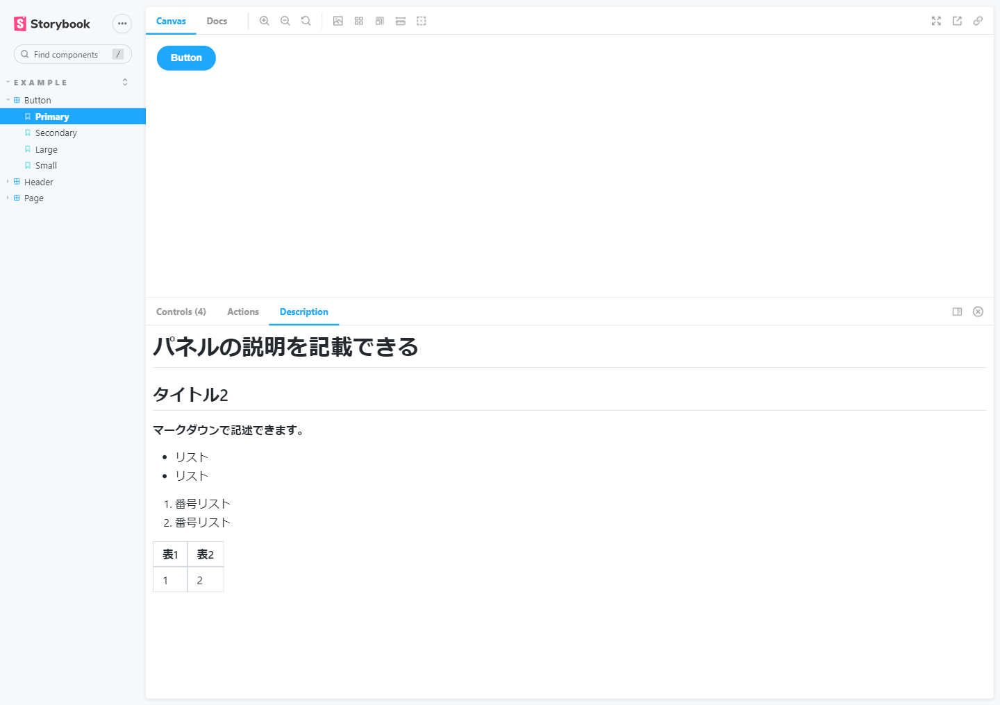

# Storybook Panel Description

- storybookのパネルにstoryの説明を記載できるアドオン
- 説明にはgfmに対応したmarkdownが使える。

## 例

```tsx
export const Primary = Template.bind({});
Primary.args = {
  primary: true,
  label: "Button",
};
Primary.parameters = {
  desc: `
# パネルの説明を記載できる

## タイトル2

**マークダウンで記述できます。**

- リスト
- リスト

1. 番号リスト
1. 番号リスト

|表1|表2|
| --- | --- |
|1|2|

`
}
```

